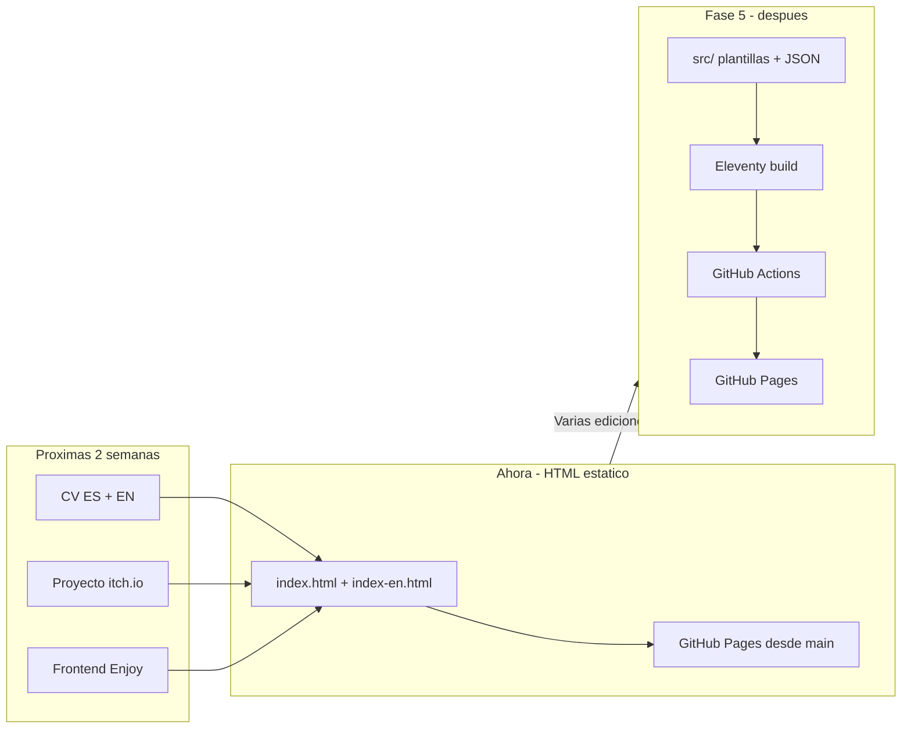
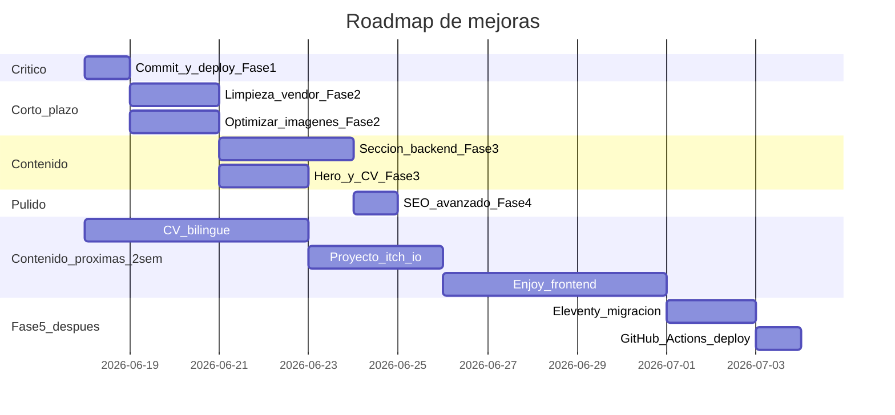

# Plan de desarrollo — Mejoras del portafolio

> Copia versionada del plan de trabajo. El original editable en Cursor vive en `.cursor/plans/plan_mejoras_portafolio_2d8455ef.plan.md` (workspace).

## Estado actual

**Rama activa:** `main` (último commit: `2bd9719`)

**Sitio en vivo:** https://vicellobre.github.io/Portafolio/

### Completado recientemente

| Área | Detalle |
|------|---------|
| **Fases 1–4** | SEO, vendor, WebP, backend, hero, CI validate, Lighthouse baseline |
| **Imágenes backend** | `coworking-app`, `enjoy-api` (branding Enjoy App), `base-project` en `#workBackend` |
| **Logo DDD** | `logo_ddd.png` / `.webp` (duplicado de Clean Architecture; skill DDD separada) |
| **Botones GitHub** | Juegos Unity + proyectos backend |
| **Categorías simuladores** | Corregidas por área académica/profesional |
| **Plan versionado** | `docs/plan-mejoras-portafolio.md` en el repo |
| **Idioma principal** | Inglés — `hreflang="x-default"` → `index-en.html` (HTML, sitemap) |
| **BaseProject por idioma** | ES → opción A (banner); EN → opción B (diagrama arquitectura) |

### BaseProject — decisión aplicada

| Idioma | Opción | Archivos | Descripción |
|--------|--------|----------|-------------|
| **ES** (`index.html`) | **A** | `base-project.png` / `.webp` | Banner .NET 10 TEMPLATE |
| **EN** (`index-en.html`) | **B** | `base-project-architecture.png` / `.webp` | Diagrama Clean Architecture / DDD / CQRS |

Archivos duplicados conservados: `base-project-en.*` (copia de opción A). Si tras un deploy no ves el cambio, usar recarga forzada (`Ctrl+F5`) — GitHub Pages y el navegador cachean imágenes con la misma URL.

### Pendiente inmediato

1. CV bilingüe (`fase3-cv`)
2. Proyecto itch.io (`contenido-itch`)
3. Frontend Enjoy (`contenido-enjoy-front`)

### Planificado (después del bloque de contenido)

Fase 5 Eleventy + GitHub Actions — **después** de Enjoy front, CV e itch.io (evitar migrar contenido aún inestable).

---

## Recomendación de arquitectura



**HTML estático ahora** porque las actualizaciones de contenido (CV, itch.io, Enjoy) se harán en las próximas 2 semanas y no requieren migrar aún.

**Fase 5 confirmada** — migrar a [Eleventy](https://www.11ty.dev/) con **GitHub Actions** para que el flujo sea: editas JSON/plantillas → push a `main` → CI compila y publica. **Sin `npm run build` en tu máquina.**

**No recomendar Astro/React** por ahora: añade complejidad sin beneficio claro para un portafolio informativo estático.

---

## Fase 1 — Consolidar y publicar (1 sesión)

**Objetivo:** Llevar a producción lo ya hecho y dejar la base estable.

| Tarea | Archivos | Detalle |
|-------|----------|---------|
| Commit en rama | `index.html`, `index-en.html`, `assets/js/main.js` | Mensaje tipo: "Mejorar SEO, accesibilidad y eliminar dependencias no usadas" |
| PR + merge a `main` | — | GitHub Pages se actualiza automáticamente desde `main` |
| Verificación manual | Sitio en vivo | Comprobar navegación, lightbox, typed hero, enlaces externos y meta tags (herramienta: [opengraph.xyz](https://www.opengraph.xyz)) |

---

## Fase 2 — Deuda técnica y rendimiento (1–2 sesiones)

**Objetivo:** Reducir peso del repo (~25 MB) y mejorar tiempos de carga sin cambiar el diseño.

### 2.1 Limpiar vendor y archivos muertos

Eliminar del repositorio (ya no se referencian en HTML/JS):
- `assets/vendor/swiper/`
- `assets/vendor/purecounter/`
- `assets/vendor/php-email-form/`
- Archivos Bootstrap no usados (`.map`, variantes RTL, fuentes sin minificar) — conservar solo lo que cargan los HTML:
  - `bootstrap.min.css`, `bootstrap.bundle.min.js`
  - `bootstrap-icons.css` (+ fuentes asociadas)
- Plantilla sobrante: `changelog.txt`, `Readme.txt`, `assets/vendor/bootstrap-icons/index.html`

**Impacto estimado:** −5 a −8 MB en el repo.

### 2.2 Optimizar imágenes

Prioridad por peso (carpeta `assets/img/`, ~7 MB):
- Comprimir JPG/PNG existentes (herramienta: Squoosh, ImageOptim o script con `sharp`)
- Generar variantes WebP y usar `<picture>` con fallback JPG
- Mantener sin lazy load: `foto.png`, `hero-bg.jpg` (above the fold)
- Revisar `assets/videos/space-shooter.mp4` — valorar thumbnail + enlace externo si pesa mucho
- **Logo DDD:** `logo_ddd.png` — hecho (duplicado de `logo_cleana`; skill DDD en ES/EN)

### 2.3 Ajustes HTML/CSS menores

- Corregir jerarquía de encabezados: secciones `h3.title-a` → tarjetas `h3` en lugar de `h2` en servicios y proyectos
- Añadir `aria-label` a iconos sociales sin texto (`LinkedIn`, `WhatsApp`, `GitHub`)
- Evaluar eliminar o acortar el preloader en [`assets/js/main.js`](d:\Proyectos\Portafolio\Portafolio\assets\js\main.js) — en sitios estáticos suele restar más que sumar

### 2.4 Documentación

Ampliar [`README.md`](d:\Proyectos\Portafolio\Portafolio\README.md):
- Descripción del proyecto y screenshot
- Stack y estructura de carpetas
- Cómo editar contenido (ES vs EN)
- URL de despliegue

---

## Fase 3 — Contenido y posicionamiento híbrido (2–3 sesiones)

**Objetivo:** Que el portafolio refleje por igual backend y game dev, no solo en el texto "Sobre mí".

### 3.1 Nueva sección: Proyectos backend

Insertar entre **Servicios** y **Videojuegos** en ambos HTML:

```html
<section id="workBackend" class="portfolio-mf sect-pt4 route">
  <!-- Tarjetas similares a #work con: nombre, stack, repo, demo si existe -->
</section>
```

Añadir enlace en navbar: "Backend" / "Backend".

**Contenido necesario de tu parte** (mínimo 2–3 proyectos):
- Nombre del proyecto
- Descripción breve (1–2 líneas)
- Stack (.NET, EF, SQL, tests, etc.)
- URL de repositorio y/o demo
- Captura o diagrama (opcional)

Si no tienes demos públicas, basta con repos de GitHub + descripción de arquitectura/pruebas.

### 3.2 Proyectos destacados en el hero

En la sección hero de [`index.html`](d:\Proyectos\Portafolio\Portafolio\index.html):

- 2 CTAs: "Ver proyectos backend" → `#workBackend`, "Ver videojuegos" → `#work`
- Enlace "Descargar CV" en hero → PDF según idioma (**demo actual; pendiente CV ES + EN**)

### 3.3 CV definitivo bilingüe (pendiente)

| Tarea | Archivos | Detalle |
|-------|----------|---------|
| Preparar CV en español | `assets/docs/cv-vicente-llobregat-es.pdf` | Versión ES con experiencia backend, Unity/Toro-Labs y contacto |
| Preparar CV en inglés | `assets/docs/cv-vicente-llobregat-en.pdf` | Versión EN equivalente (no traducción automática) |
| Enlazar por idioma | `index.html`, `index-en.html` | Hero ES → PDF ES; hero EN → PDF EN |
| Eliminar demo | `assets/docs/cv-vicente-llobregat.pdf` | Retirar placeholder actual tras subir los definitivos |

### 3.4 Enriquecer tarjetas de proyectos existentes

Por cada juego en `#work`, añadir línea de tecnologías:

```html
<span class="w-ctegory">Unity · C# · WebGL</span>
```

En simuladores (`#workCL`), indicar rol ("Unity Developer en Toro-Labs") y categoría (educación/industrial).

### 3.5 Revisión de copy

- Unificar tono profesional en ES/EN
- Actualizar párrafo final de "Sobre mí" con objetivo concreto (ej. "busco roles de backend .NET o Unity developer")
- Revisar si exponer teléfono completo o solo WhatsApp/LinkedIn

---

## Fase 4 — Calidad, SEO avanzado y despliegue (1 sesión)

| Tarea | Beneficio |
|-------|-----------|
| Añadir `sitemap.xml` y `robots.txt` en raíz | Indexación en buscadores |
| JSON-LD `Person` + `WebSite` en `<head>` | Rich results en Google |
| Probar con Lighthouse (móvil) | Baseline de performance/a11y |
| Añadir `.github/workflows/` opcional para validar HTML o comprimir imágenes en PR | Prevención de regresiones |

**Meta Lighthouse objetivo:** Performance ≥ 85, Accessibility ≥ 90, SEO ≥ 95. **Cumplido** en baseline jun 2026.

---

## Contenido pendiente — próximas ~2 semanas

Actualizaciones previstas **antes** de Fase 5. Se harán sobre HTML estático actual; luego se migrarán los datos a JSON en Eleventy.

| ID | Tarea | Detalle | Bloqueado por |
|----|-------|---------|---------------|
| `fase3-cv` | CV bilingüe | PDF ES + PDF EN; botón del hero apunta al idioma correcto | Usuario prepara PDFs |
| `contenido-itch` | Proyecto itch.io | Nueva tarjeta en `#work`: nombre, captura, enlace itch.io, stack, botón GitHub si aplica | URL/captura del juego en itch.io |
| `contenido-enjoy-front` | Frontend Enjoy API | Sustituir modal de mantenimiento por enlace demo real; actualizar descripción/captura si cambia | Frontend Enjoy terminado |

### Imágenes backend — estado

| Proyecto | ES | EN | Estado |
|----------|----|----|--------|
| CoWorkingApp | `coworking-app.*` | `coworking-app.*` | Hecho |
| Enjoy API | `enjoy-api.*` | `enjoy-api.*` | Hecho |
| BaseProject | `base-project.*` (opción A) | `base-project-architecture.*` (opción B) | Hecho |

**Orden sugerido:** CV → itch.io → Enjoy → Fase 5.

---

## Fase 5 — Eleventy + GitHub Actions (desarrollo posterior)

**Decisión:** activar Fase 5 **después** de las actualizaciones de contenido de las próximas 2 semanas. El volumen de cambios ES/EN justifica la migración.

**Objetivo:** una sola fuente de verdad (plantillas + JSON) y **cero compilación local** — GitHub Actions hace build y deploy automáticamente.

### 5.1 Estructura propuesta

```
src/
  _includes/           # header, footer, head, modal mantenimiento
  _data/
    site-es.json       # textos UI (hero, about, nav)
    site-en.json
    projects-backend-es.json
    projects-backend-en.json
    projects-games-es.json
    projects-games-en.json
    projects-simulators-es.json
    projects-simulators-en.json
  es/index.njk
  en/index.njk
.eleventy.js
package.json
```

**Salida del build:** carpeta `_site/` (o `docs/`) con HTML estático listo para GitHub Pages.

### 5.2 GitHub Actions — build y deploy automático

Workflow propuesto: `.github/workflows/deploy.yml`

```yaml
# Pseudocódigo del flujo
on:
  push:
    branches: [main]
  pull_request:
    branches: [main]

jobs:
  build:
    - checkout
    - setup-node
    - npm ci
    - npm run build          # eleventy → _site/
    - html-validate _site/   # reutilizar validación Fase 4

  deploy:                    # solo en push a main
    - upload-pages-artifact  # o commit a gh-pages / docs/
    - deploy-github-pages
```

**Flujo para el usuario (Vicente):**
1. Editas `projects-games-es.json` (añades itch.io) o subes CV a `assets/docs/`
2. `git push origin main`
3. GitHub Actions compila Eleventy y publica — **no ejecutas nada en tu PC**

**Config GitHub Pages:** pasar de “servir rama `main`” a “servir artefacto del workflow” (GitHub Pages con Actions).

### 5.3 Ventajas

- Un layout compartido; proyectos en JSON (no duplicar ~50 tarjetas × 2 idiomas)
- Añadir itch.io o un simulador = editar JSON, no 60 líneas HTML × 2
- CV por idioma: rutas en `site-es.json` / `site-en.json`
- CI existente (`validate.yml`) se extiende al HTML generado
- Mismo sitio en producción; el visitante no nota diferencia

### 5.4 Esfuerzo y criterios

| Aspecto | Estimación |
|---------|------------|
| Migración inicial | 1–2 días |
| Workflow deploy | ~2–4 h |
| Riesgo | Regresiones visuales ES/EN — comparar 1:1 antes de cortar HTML manual |

**No iniciar hasta:** CV bilingüe, itch.io y Enjoy (si aplica) aplicados en HTML, para migrar contenido ya estable a JSON.

---

## Priorización resumida



| Prioridad | Fase | Esfuerzo | Impacto |
|-----------|------|----------|---------|
| P0 | Fase 1 — Publicar cambios actuales | Bajo | Alto |
| P1 | Fase 2 — Limpieza + imágenes | Medio | Alto (performance) |
| P2 | Fase 3 — Sección backend + hero | Medio | Alto (empleabilidad) |
| P2 | Contenido — CV bilingüe | Bajo | Alto (empleabilidad) |
| P2 | Contenido — proyecto itch.io | Bajo | Medio |
| P2 | Contenido — frontend Enjoy | Bajo | Medio |
| P3 | Fase 4 — SEO avanzado + Lighthouse | Bajo | Medio |
| P3 | Fase 5 — Eleventy + GitHub Actions | Alto | Alto (mantenimiento) |

---

## Próximo paso concreto

**Ahora (próximas 2 semanas — HTML estático):**
1. Preparar y subir **CV en español e inglés** (`cv-vicente-llobregat-es.pdf` / `-en.pdf`)
2. Añadir **proyecto de itch.io** a videojuegos (pasar URL, captura y nombre cuando esté listo)
3. **Actualizar Enjoy** cuando el frontend esté terminado (demo real, quitar modal)

**Después (Fase 5 — sesión dedicada):**
4. Migrar a **Eleventy** con datos en JSON
5. Configurar **GitHub Actions** para build + deploy automático (sin compilar en local)
6. Cambiar GitHub Pages a publicación vía workflow
